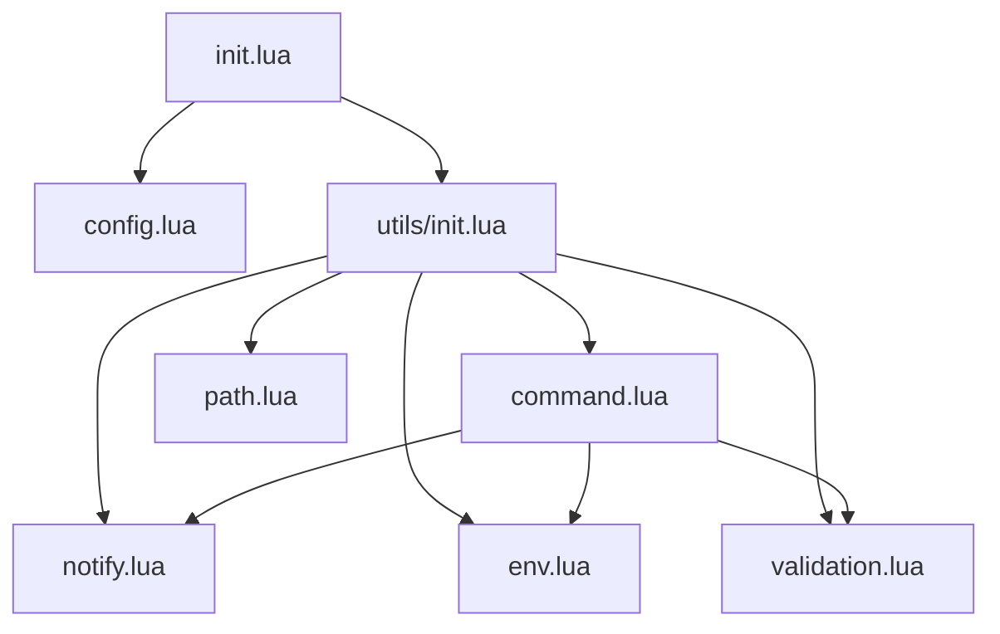

# run.nvim Developer Documentation

## Overview
run.nvim is a Neovim plugin that provides a flexible and powerful command execution framework. It supports running shell commands, Vim commands, and Lua functions with advanced features like command chaining, environment variable management, and error handling.

## Project Structure

```
run.nvim/
├── lua/
│   └── run/
│       ├── init.lua           # Plugin entry point and setup
│       ├── config.lua         # Configuration management
│       └── utils/
│           ├── init.lua       # Utils module aggregator
│           ├── command.lua    # Command execution core
│           ├── env.lua        # Environment variable handling
│           ├── notify.lua     # Notification utilities
│           ├── validation.lua # Input validation
│           └── path.lua       # Path manipulation utilities
```

## Module Dependency Tree



## Core Components

### 1. Command Execution (command.lua)
The command execution module is the core of run.nvim. It handles:
- Single command execution
- Command chain processing
- Command type detection and handling
- Error management

#### Command Types
1. **Shell Commands**: Regular shell commands (e.g., "ls -la")
2. **Vim Commands**: Commands starting with ":" (e.g., ":write")
3. **Function Commands**: Lua functions that return commands

#### Command Chain Format
```lua
{
    "echo 'Start'",                              -- Simple shell command
    ":write",                                    -- Vim command
    function() return "echo 'Dynamic'" end,      -- Function command
    {
        cmd = "risky-command",
        continue_on_error = true                 -- Error handling
    },
    {
        cmd = "echo 'Always'",
        always_run = true                        -- Always executes
    },
    {
        cmd = "conditional-cmd",
        when = function() return checkCondition() end  -- Conditional execution
    }
}
```

### 2. Environment Variables (env.lua)
Handles environment variable processing and system environment merging.

#### Environment Configuration Format
```lua
{
    env = {
        CUSTOM_VAR = "value",
        PATH = function() return vim.fn.expand("$PATH") .. ":/custom/path" end
    }
}
```

### 3. Configuration (config.lua)
Manages plugin configuration and project-specific settings.

#### Configuration Format
```lua
{
    proj = {
        build = {
            cmd = "make",
            env = { ... }
        },
        test = {
            cmd = { ... }  -- Command chain
        }
    }
}
```

## Command Execution Flow

1. **Command Processing**:
   ```
   Input Command
   ├── Preprocess (handle %f substitution)
   ├── Validate
   └── Type Detection
       ├── Function → Execute → Get Result
       ├── Vim Command → Convert to Shell
       └── Shell Command → Format
   ```

2. **Chain Execution**:
   ```
   Command Chain
   ├── Extract Callbacks
   ├── Process Each Command
   │   ├── Check Conditions
   │   ├── Handle Wait Conditions
   │   ├── Process Command
   │   └── Build Shell Command
   └── Execute in Single Terminal
   ```

## Error Handling

1. **Command Level**:
   - `continue_on_error`: Allows chain to continue if command fails
   - `always_run`: Ensures command runs regardless of previous failures
   - Error callbacks for handling failures

2. **Chain Level**:
   - Success/error callbacks
   - Proper error propagation
   - Timeout handling for wait conditions

## Terminal Integration

The plugin uses FTerm for terminal integration, providing:
- Single terminal instance for command chains
- Environment variable support
- Non-blocking execution
- Proper command output handling

## Best Practices

1. **Command Construction**:
   - Use command chains for related commands
   - Leverage error handling options
   - Utilize environment variables for configuration

2. **Error Handling**:
   - Always handle potential errors in function commands
   - Use continue_on_error for non-critical commands
   - Implement error callbacks for important operations

3. **Environment Variables**:
   - Keep environment variables project-specific
   - Use functions for dynamic values
   - Merge with system environment when needed

## Contributing

When contributing to run.nvim:

1. **Code Organization**:
   - Keep modules focused and single-purpose
   - Follow existing error handling patterns
   - Maintain proper module dependencies

2. **Testing**:
   - Test all command types
   - Verify error handling
   - Check environment variable processing

3. **Documentation**:
   - Update this developer documentation
   - Add inline comments for complex logic
   - Include examples for new features

## Common Patterns

### 1. Command Chain with Error Handling
```lua
{
    ":write",                                -- Save current buffer
    { cmd = "make", continue_on_error = true }, -- Build, continue if fails
    {
        cmd = "echo 'Tests'",
        when = function() return vim.v.shell_error == 0 end
    },
    { cmd = "echo 'Done'", always_run = true }  -- Always runs
}
```

### 2. Dynamic Environment Variables
```lua
{
    env = {
        PATH = function()
            local base_path = vim.fn.expand("$PATH")
            local project_path = vim.fn.getcwd() .. "/bin"
            return base_path .. ":" .. project_path
        end
    }
}
```

### 3. Conditional Command Execution
```lua
{
    cmd = "npm test",
    when = function()
        local file = io.open("package.json", "r")
        return file ~= nil and io.close(file)
    end
}
```
